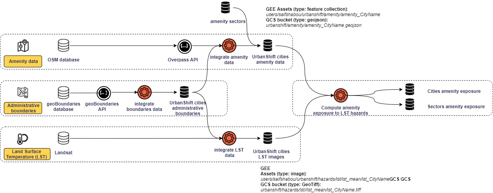

# Introduction

As a part of the Data Portal for Cities project, this work aims at providing a prototype tool for helping cities in climate hazards adaptation planning. 

The following document describes the methodological framework used for computing indicators on amenity exposure to heat hazards.

# Data sources

| Dataset | Source |  Data integration scripts | Data description | Data storage path | Format | Data exploration |
| ------ |------ |------ |------ |------ | ------ | ------ | 
| Administrative boundaries | geoBoundaries database| | [GeoLayers.Administrative boundaries](https://github.com/wri/cities-urbanshift/wiki/GeoLayers.Administrative-boundaries) |  [download from GCS](https://storage.googleapis.com/urbanshift/administrative_boundaries/v1/administrative_boundaries_urbanshift_cities.geojson) | `geojson` | |
| Amenities | Open Street Map |[integrate_amenity_data.ipynb](https://github.com/wri/cities-urbanshift/blob/main/geospatial-layers/scripts/amenity/integrate_amenity_data.ipynb)| [GeoLayers.Amenity](https://github.com/wri/cities-urbanshift/wiki/GeoLayers.Amenity) |  [download from GCS](https://storage.googleapis.com/urbanshift/amenity/amenity_all_cities.geojson) |  `geojson` | |
| Amenities sectors | global covenant of mayor [GCRF](https://www.globalcovenantofmayors.org/our-initiatives/data4cities/common-global-reporting-framework/)| | [GeoLayers.Amenity](https://github.com/wri/cities-urbanshift/wiki/GeoLayers.Amenity) |  [download from GCS](https://storage.googleapis.com/urbanshift/amenity/param/osm_amenity_sectors.csv) |  `csv` | |
| Land Surface Temperature | Landsat |[integrate_lst_data.js](https://code.earthengine.google.com/5b00ea20c399c16c41c7c2ea98a08586?accept_repo=users%2Femackres%2FSCIP)| [GeoLayers.Land Surface Temperature](https://github.com/wri/cities-urbanshift/wiki/GeoLayers.Land-Surface-Temperature) |  [download from GCS](https://storage.googleapis.com/urbanshift/lst/lst_Mean/lst-ARG-Mendoza.tif) |  `GeoTIFF` | |
| Population | WorldPop ||  |   |  `GeoTIFF` | |

## Administrative boundaries

Two data sources are used for collecting the administrative boundaries regarding the selected cities: the geoBoudnaries database and Open Street Map. 

## Amenities

### Amenity data
Amenity data is provided by Open Street Map and collected by the mean of the [Overpass API](https://python-overpy.readthedocs.io/en/latest/introduction.html). OpenStreetMap's [free tagging system](https://wiki.openstreetmap.org/wiki/Tags) allows the map to include an unlimited number of attributes describing each feature. These tags are represented in *key: value* structure. The *key*, is used to describe a topic, category, or type of feature (e.g., highway or name). The *value* provides detail for the key-specified feature. For example, school features can be tagged with `key = amenity and value = school`.

For each city, we collected the location and attributes of available amenities situated within the city boundary. The data is stored in Google Cloud Storage bucket. 

### Sector categories

In order to provide exposure indicators by sector, we associated each amenity with a sector name based on the sector taxonomy provided by the CRF document of GCOM. This mapping between the amenities and sector categories is provided by the mean of a mapping file stored in the datalake.

## Land Surface Temperature (LST)

Land Surface Temperature estimation within the city boundary is based on Landsat data provided with high spatial resolution (30m). In order to collect this data, we used an open source library provided by `Sofia L. Ermida` based on the Google Earth Engine ([Link to the artilce](https://www.mdpi.com/2072-4292/12/9/1471)). We extracted for each city an average heat value for a 3 months period corresponding to the hot season.
Here is an example of parameters used for collecting LST data for the city of 'Marroco':
 
``` js
var satellite = 'L8';
var date_start = '2018-03-01';
var date_end = '2021-04-30';
var month_start = 6;
var month_end = 9;
var use_ndvi = true;
```

# Data workflow



# Methdology

## Amenity exposure

### Amenity exposure definition

Amenity exposure to heat may be quantified simply as the heat value (as collected from Landsat) at the amenity location. Since our goal consists of identifying the most exposed amenities within each city, we need to define an indicator that may inform us about within city variability of exposed amenities.

Two methods have been explored for quantifying amenity exposure to heat:

- **Deviation from city average heat value**: It consists of comparing each amenity heat value with the city average heat value (considered hence as exposure threshold). 
$$Exposure_{amenity} = (\frac {Heat_{amenity}}{HeatThreshold_{city}} * 100) - 100$$
- **Deviation from average amenity heat value**: It consists of computing for each amenity a deviation ratio to the whole average amenities heat.

$$Exposure_{amenity} = (\frac {Heat_{amenity}}{HeatThreshold_{city}} * 100) - 100$$


### Sector exposure definition

Two metrices are provided in order to characterize sectors' exposure to heat:

- **Average deviation ratio by sector**: It consists of computing the average deviation ratio of amenities at the sector level. 

- **Percent of exposed amenities**: It consists of computing for each sector the percent of amenities with heat value above the average.

### Exposure Index

Amenity exposure level depends on two components: Number of amenities and heat deviation ratio. In order to identify the location of exposure hotspots, we propose here to compute an exposure index by spatially weighting the number of amenities by the heat deviation ratio as expressed by the following equations:

- Computing exposure index values:

$$ExposureLevel_{cell} =\sum_{x = i}^{nb_{cells}}NumberOfAmenities_{i}*ExposureAmenity_{i}$$

- Normalizing the exposure index:

$$ExposureIndex_{cell} = \frac {ExposureLevel_{cell} - min(ExposureLevel_{city})}{max(ExposureLevel_{city}) - min(ExposureLevel_{city})}$$


### Limitations & Perspectives

- **Amenity data coverage:** In this analysis we used amenity deata provided by Open Street Map API. Since the data is not complete and may differ between cities, our results are biased by data coverage. More efforts are then needed for evaluating data coverage and integratin other datasources such as [Google Places API](https://developers.google.com/maps/documentation/places/web-service/overview) or [Google Open Buildings dataset](https://sites.research.google/open-buildings/).

- **Definition of heat hazard**

- **Definition of the most relevant administrative level in the boundaries data**

## Population exposure

# Technical documentation
## Dashboard inputs

### Datasets

| dataset name | description | format | storage |
| ---- | ----- | ----- |  ----- |
| boundary | Administrative boundaries of pilot cities | `geojson` | |
| land_surface_temperature | Raster layer of Land Surface Temperature within the city boundary box | `geotiff` | |
| amenity_exposure_lst | Amenities' exposure to heat | `csv` | |
| city_pop | Raster layer of Population data within the city boundary box | `geotiff` | |

#### boundary

| field name | field description |
| ---- | ----- |
| country_iso3 | Code ISO 3 of the country |
| city_id | City identifier: A concatenation of Country code iso 3 with the city name (e.g., `PHL-Makati`)|
| city_name | Name of the city |
| boundary_data_source | Source name of the boundary data (e.g., `osm`) |
| geometry | Coordinates of the boundary polygons (CRS: ESPG 4326) |

#### amenity_exposure_lst

| field name | field description |
| ---- | ----- |
| id | Feature id based on OSM data |
| city_name | Name of the city |
| cityName | Name of the city |
| country_iso | Code ISO 3 of the country  |
| country_iso3 | Code ISO 3 of the country  |
| city_id | City identifier (Country code iso 3 - city name)  |
| latitude | Latitude of the geographical position of the amenity (CRS: ESPG 4326) |
| longitude | longitude of the geographical position of the amenity (CRS: ESPG 4326) |
| geometry | Amenity coordinates (CRS: ESPG 4326) |
| feature_key | feature key based on OSM taxonomy (e.g., amenity, building...) |
| featureCategory | feature key based on OSM taxonomy (e.g., amenity, building...) |
| objectType| feature key based on OSM taxonomy (e.g., amenity, building...) |
| feature_category | feature category based on OSM taxonomy (e.g., Entertainment_Art_Culture, Transportation, Healthcare...) |
| featureType | feature category based on OSM taxonomy (e.g., Entertainment_Art_Culture, Transportation, Healthcare...) |
| sector_name | Name of the sector category based on OSM taxonomy |
| gcom_sector_name | Name of the sector category based on GCOM taxonomy |
| city_lst_avg | Average heat value within the city boundary |
| city_lst_perc_90 | 90th percentile of heat value within the city boundary |
| exposure_lst_mean | Average heat value at the amenity position based on Land Surface Temperature estimation |
| lst_value_dev_city_mean | Deviation from city average heat value (Celsus) |
| lst_pecent_dev_city_mean | Deviation ratio from city average heat value (percent) |
| lst_dev_city_mean_exposure_class | Amenity exposure class (`Exposed`; `Not Exposed`). Amenity is considered as exposed if the average heat value at the amenity location *(exposure_lst_mean)* is higher than the city average heat value *(city_lst_avg)* |
| lst_value_dev_city_perc_90 | Deviation from city 90th percentile heat value (Celsus) |
| lst_pecent_dev_city_perc_90 | Deviation ratio from city 90th percentile heat value (percent) |
| lst_dev_city_perc90_exposure_class | Amenity exposure class (`Exposed`; `Not Exposed`). Amenity is considered as exposed if the average heat value at the amenity location *(exposure_lst_mean)* is higher than the city 90th percentile heat value *(city_lst_perc_90)* |
| integrationDate | Date of amenity data collection from OSM API |
| projectName | Name of the project concerned by the collected amenities |
| heat_dev_from_amenities | Heat deviation  value from amenities' average heat |


### Filters

| filter category |variable name | variable description |
| ---- | ----- | ----- |
| City | available_cities | A list of available cities: distinct `city_name` from `amenity_exposure_lst` table |
| Hazard | available_hazards | A list of available hazards: Only heat hazard is implemented |
| Period | available_periods| A list of available periods: Only `2020-2021` period is implemented |
| Amenity sectors | available_amenity_sectors | A list of available amenities' sectors:  distinct `gcom_sector_name` from `amenity_exposure_lst` table |
| Population category | available_pop_categories | A list of available population categories: `All`, `Young (<20)`, `Elderly (>60)`, `Men`, `Women` |
| Heat threshold slider | slider_min_heat | Minimum amenities' heat value depending on the selected city: *(min(amenity_exposure_lst) from `amenity_exposure_lst` table)* |
| Heat threshold slider | slider_max_heat | Maximum amenities' heat value depending on the selected city: *(max(amenity_exposure_lst) from `amenity_exposure_lst` table)* |
| Heat threshold slider | slider_value_heat | Average amenities' heat value depending on the selected city: *(mean(amenity_exposure_lst) from `amenity_exposure_lst` table)* |


### User inputs 

| Tab | filter category |filter id| filter description |
| ----- | --- | ----- | ----- |
| Amenity exposure | City selection| City | Select a city among a list of available cities *(by default city = `PHL-Makati`)* |
| Amenity exposure | Hazard selection| Hazard| Select a hazard among a list of available hazards *(by default hazard = `Heat`)* |
| Amenity exposure | Period selection| Period| Select a Period among a list of available periods *(by default hazard = `2020-2021`)* |
| Amenity exposure | Amenity sectors' selection| Sector | Select a Period among a list of available sectors *(available_amenity_sectors)*. By default, all amenities' sectors are selected. |
| Amenity exposure | Heat threshold selection| heat_threshold | Select a heat threshold value to consider for assessing amenities' exposure. By default, average amenities' heat value is selected *(slider_value_heat)*. |

## Dashboard outputs

### Amenity exposure tab

#### Datasets

#### city_boundary

- This dataset is generated by filtering the `boudary` geojson file based on the selected `city`.

#### city_amenity

- This dataset is generated by filtering the input `amenity_exposure_lst` table based on the following selected filters: `city`, `sectors`.  

- Two columns are added in this table in order to recompute amenities' exposure based on the user defined heat threshold
  - `deviation_from_threshold`: Amenity heat deviation ratio from selected heat threshold. $DeviationFromThreshold_{Amenity} = (\frac {Heat_{amenity}}{HeatThreshold_{user}} * 100) - 100$
  - `exposure_class`: We attribute an exposure class to each amenity deoending on the deviation ratio from heat threshold. 

| deviation_from_threshold | exposure_class |
| ----- | --- |
| Lower than 0% | 0-Low |
| Lower than 10% | 1-Moderate |
| Higher than 10% | 2-High |

#### city_amenity_sector_exposure

- This dataset is generated by aggregating amenity exposure values by sectros in order to identify the most exposed assets sectors

| field name | field description |
| ---- | ----- |
| gcom_sector_name | Name of the sector based on GCOM categories |
| nb_amenities | Number of amenities by sector |
| lst_min | Minimum heat value by sector |
| lst_max | Maximum heat value by sector |
| lst_mean | Average heat value by sector |
| nb_exposed_amenities_amenity_threshold | Number of amenities exposed to higher heat values than the selected heat threshold  |
| deviation_amenity_threshold | Average deviation ratio from heat threshold by sector  |
| exposure_class | Classification of sectors' exposure based on the average deviation ratio.  |
| exposure_color | Colors associated with sector exposure class  |
| percent_exposed_amenities | Percent of amenities exposed to higher heat values than the selected threshold  |

| deviation_amenity_threshold | exposure_class |
| ----- | --- |
| Lower than 0% | 0-Low |
| Lower than 10% | 1-Moderate |
| Higher than 10% | 2-High |

#### Main indicators

| Indicator name | Indicator id | Indicator description | 
| ----- | --- | ----- | 
| Amenity average heat value (selected sectors) | `selected_amenities_avg_heat` | Average heat value of amenities based on selected city and sectors of interest | 
| Selected amenities heat deviation from all amenities | `selected_amenities_deviation_heat_value` | Average heat deviation of selected amenities from all amenities located within the city boundary | 
| Selected amenities heat deviation ratio from all amenities | `selected_amenities_deviation_heat_ratio` | Heat deviation ratio of selected amenities from all amenities located within the city boundary | 

#### Map

- **Layer 1: Land Surface Temperature:** 

This layer shows the spatial distribution of land surface temperature within the city boundary at 30m resolution. 

- **Layer 2: Amenity exposure value:**

This layer shows the heat value corresponding to the amenities positions (based on land surface temperature layer).

- **Layer 3: Amenity exposure class:**

This layer shows amenities' exposure classification based on the deviation ratio of the user' selected heat threshold. Three classes are proposed: `Low` (amenities are located in area with lower heat value than heat threshold), `Moderate` (amenities are located in area with heat deviation ratio up to 10% higher than heat threshold), and `high` (amenities are located in area with heat deviation ratio 10% higher than heat threshold).


#### Amenity exposure table

This table provides summary statistics on sectors' exposure to heat hazard. 

| field name | field description |
| ---- | ----- |
| sector name | Name of the sector based on GCOM categories |
| Number of amenities | Number of amenities by sector |
| Min heat value | Minimum heat value by sector |
| Max heat value | Maximum heat value by sector |
| Average heat value | Average heat value by sector |
| Number of exposed amenities | Number of amenities exposed to higher heat values than the selected heat threshold  |
| Percent of exposed amenities | Percent of amenities exposed to higher heat values than the selected threshold  |
| Average deviation ratio | Average deviation ratio from heat threshold by sector  |
| Exposure category | Classification of sectors' exposure based on the average deviation ratio.  |


#### Sector exposure bar chart

This bar chart shows 

#### Narrative summary

### Population exposure tab


